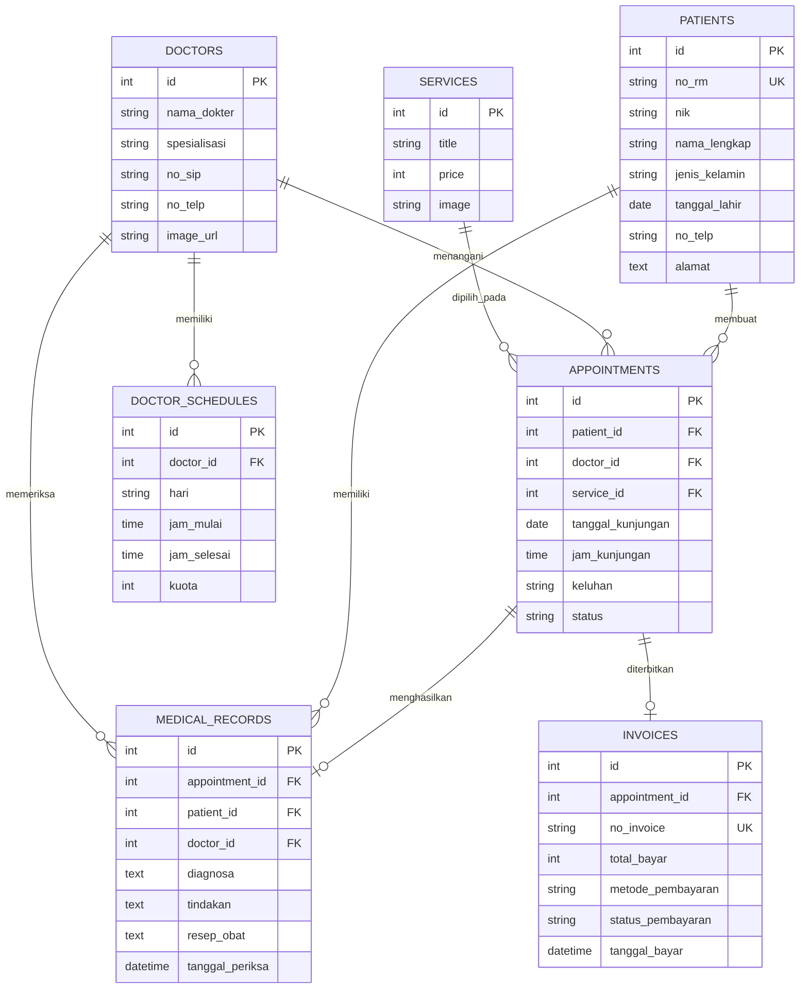

# API Design & ERD — Final Project (Sehatin)

Dokumentasi rancangan API dan Entity Relationship Diagram (ERD) untuk aplikasi klinik Sehatin.

---

## 1. API Design

### Fitur Layanan Medis (Services)
| HTTP Method | Endpoint | Deskripsi |
| :--- | :--- | :--- |
| `GET` | `/services` | Mengambil semua daftar layanan klinik |
| `GET` | `/api/services/:id` | Mengambil detail layanan berdasarkan ID |
| `POST` | `/api/services` | Menambahkan data layanan baru |
| `PUT` | `/api/services/:id` | Mengupdate data layanan klinik |
| `DELETE` | `/api/services/:id` | Menghapus layanan klinik |

### Fitur Dokter & Jadwal (Doctors & Schedules)
| HTTP Method | Endpoint | Deskripsi |
| :--- | :--- | :--- |
| `GET` | `/api/doctors` | Mengambil daftar seluruh dokter |
| `GET` | `/api/doctors/:id` | Mengambil detail profil dokter |
| `GET` | `/api/doctors/:id/schedules` | Mengambil jadwal praktek dokter |
| `POST` | `/api/doctors` | Menambahkan data dokter baru |
| `PUT` | `/api/doctors/:id` | Mengupdate profil dokter |
| `POST` | `/api/doctors/:id/schedules` | Menambahkan jadwal praktek dokter |
| `DELETE` | `/api/doctors/:id` | Menghapus data dokter |

### Fitur Pasien (Patients)
| HTTP Method | Endpoint | Deskripsi |
| :--- | :--- | :--- |
| `GET` | `/api/patients` | Mengambil data seluruh pasien |
| `GET` | `/api/patients/:id` | Mengambil detail pasien dan riwayatnya |
| `POST` | `/api/patients` | Mendaftarkan data pasien baru |
| `PUT` | `/api/patients/:id` | Mengupdate data identitas pasien |
| `DELETE` | `/api/patients/:id` | Menghapus data pasien |

### Fitur Reservasi / Janji Temu (Appointments)
| HTTP Method | Endpoint | Deskripsi |
| :--- | :--- | :--- |
| `GET` | `/api/appointments` | Mengambil daftar janji temu |
| `GET` | `/api/appointments/:id` | Mengambil detail janji temu |
| `POST` | `/api/appointments` | Membuat booking janji temu baru |
| `PATCH` | `/api/appointments/:id/status` | Mengupdate status janji temu (pending, confirmed, completed, cancelled) |
| `DELETE` | `/api/appointments/:id` | Membatalkan janji temu |

### Fitur Rekam Medis (Medical Records)
| HTTP Method | Endpoint | Deskripsi |
| :--- | :--- | :--- |
| `GET` | `/api/medical-records` | Mengambil daftar rekam medis |
| `GET` | `/api/medical-records/:id` | Mengambil detail hasil pemeriksaan dan resep |
| `GET` | `/api/patients/:id/medical-records` | Mengambil riwayat rekam medis pasien tertentu |
| `POST` | `/api/medical-records` | Menambahkan catatan pemeriksaan dokter |
| `PUT` | `/api/medical-records/:id` | Mengupdate catatan rekam medis |

### Fitur Pembayaran / Invoice (Billing)
| HTTP Method | Endpoint | Deskripsi |
| :--- | :--- | :--- |
| `GET` | `/api/invoices` | Mengambil daftar invoice/tagihan |
| `GET` | `/api/invoices/:id` | Mengambil detail tagihan pembayaran |
| `POST` | `/api/invoices` | Membuat tagihan pembayaran baru |
| `PATCH` | `/api/invoices/:id/payment` | Mengupdate status pembayaran (paid, unpaid) |

---

## 2. Entity Relationship Diagram (ERD)

### Tabel yang Diperlukan:
1. **patients**: Data identitas pasien (`id`, `no_rm`, `nik`, `nama_lengkap`, `jenis_kelamin`, `tanggal_lahir`, `no_telp`, `alamat`).
2. **doctors**: Data tenaga medis/dokter (`id`, `nama_dokter`, `spesialisasi`, `no_sip`, `no_telp`, `image_url`).
3. **services**: Data layanan klinik (`id`, `title`, `price`, `image`). Selaras dengan data pada endpoint `/services`.
4. **doctor_schedules**: Jadwal praktek dokter (`id`, `doctor_id`, `hari`, `jam_mulai`, `jam_selesai`, `kuota`).
5. **appointments**: Reservasi janji temu pasien (`id`, `patient_id`, `doctor_id`, `service_id`, `tanggal_kunjungan`, `jam_kunjungan`, `keluhan`, `status`).
6. **medical_records**: Rekam medis hasil diagnosa dan resep dokter (`id`, `appointment_id`, `patient_id`, `doctor_id`, `diagnosa`, `tindakan`, `resep_obat`, `tanggal_periksa`).
7. **invoices**: Data tagihan dan status pembayaran (`id`, `appointment_id`, `no_invoice`, `total_bayar`, `metode_pembayaran`, `status_pembayaran`, `tanggal_bayar`).
