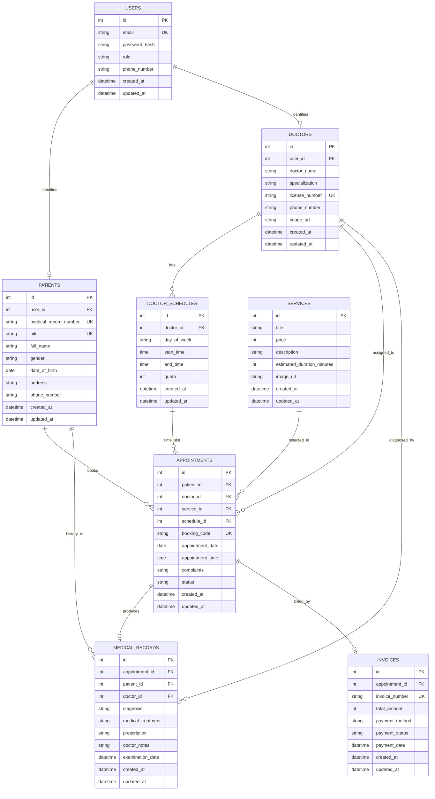

# 🩺 Sehatin — Sistem Informasi Layanan & Reservasi Klinik Keluarga
> **Final Project — Web Application Development (WAD)**  
> **Kelompok 7 • S1 Ilmu Komputer — Universitas Cakrawala**

---

## 👥 Anggota Kelompok 7
| No | Nama Mahasiswa | NIM | Peran Utama |
| :---: | :--- | :---: | :--- |
| 1 | **Muhammad Farrel Al Ghifary** | 25110300026 | Fullstack & Koordinasi Proyek |
| 2 | **Kevin Arya Saputra** | 25110300007 | Backend & Integrasi Data |
| 3 | **Chandra Tabligh Wiguna** | 25110300017 | Frontend Development |
| 4 | **Brilliant Gibran Adhinata** | 25110300019 | API Design, Database & ERD Architecture |
| 5 | **Nawwaf Dzakwan Sigit** | 25110300022 | UI/UX & Testing Quality Assurance |

---

## 📖 Deskripsi Proyek
**Sehatin** adalah platform aplikasi web layanan klinik kesehatan keluarga modern yang mengintegrasikan frontend interaktif (*React + Vite + Tailwind CSS*) dengan backend REST API (*Node.js + Express.js*). 

Sistem ini memudahkan pasien untuk mengeksplorasi katalog layanan medis (Konsultasi Umum, Pemeriksaan Gigi, Konsultasi Kulit, Medical Check-up), melihat profil dokter terpercaya, menjadwalkan kunjungan secara daring (*reservasi janji temu*), serta memantau riwayat rekam medis dan transaksi pembayaran secara terpusat dan transparan.

---

## 🛠️ Tech Stack
- **Frontend**: React 19, Vite, Tailwind CSS, Local Storage State Caching
- **Backend**: Node.js, Express.js, CORS Middleware
- **Database Architecture**: Relational Database Management System (RDBMS)
- **API Architecture**: RESTful API Standard (JSON Payload)

---

## 📁 Struktur Direktori Repository
```text
wad-kelompok-7/
├── backend/
│   ├── node_modules/
│   ├── package.json
│   ├── package-lock.json
│   └── server.js               # Express API server (port 3000)
├── frontend/
│   ├── public/
│   ├── src/
│   │   ├── assets/
│   │   ├── components/         # Header, Footer, Hero, FeatureGrid, FeatureCard
│   │   ├── data/               # clinicServices.js, features.js
│   │   ├── hooks/              # usePath.js
│   │   ├── pages/              # Home, About, Services, Pricing
│   │   ├── App.jsx
│   │   ├── App.css
│   │   └── main.jsx
│   ├── index.html
│   ├── package.json
│   └── vite.config.js
├── docs/
│   ├── API_DESIGN.md           # Spesifikasi detail REST API Sehatin
│   └── ERD.md                  # Spesifikasi detail ERD & Kamus Data Relasional
└── README.md                   # Dokumentasi utama proyek
```

---

## 📋 1. API Design Specification
Perancangan antarmuka pemrograman aplikasi (REST API) disusun dengan konvensi penamaan jamak (*plural noun*), pemanfaatan *HTTP methods* standar industri, dan dikelompokkan berdasarkan modul fitur:

### 🔐 A. Fitur Autentikasi & Akun Pengguna
| HTTP Method | Endpoint | Deskripsi |
| :--- | :--- | :--- |
| `POST` | `/api/v1/auth/register` | Mendaftarkan akun pasien baru ke dalam sistem. |
| `POST` | `/api/v1/auth/login` | Melakukan autentikasi kredensial pengguna dan mengembalikan JWT token. |
| `GET` | `/api/v1/auth/me` | Mengambil data profil pengguna yang sedang login. |
| `PUT` | `/api/v1/auth/me` | Memperbarui profil data akun pengguna. |
| `POST` | `/api/v1/auth/logout` | Mengakhiri sesi login pengguna. |

### 🏥 B. Fitur Katalog Layanan Medis (Clinic Services)
*Endpoint `GET /services` selaras langsung dengan backend Express eksisting (`backend/server.js`).*

| HTTP Method | Endpoint | Deskripsi |
| :--- | :--- | :--- |
| `GET` | `/services` *(Root)* | Mengambil daftar seluruh layanan klinik (kompatibilitas backward `backend/server.js`). |
| `GET` | `/api/v1/services` | Mengambil seluruh katalog layanan klinik aktif beserta harga dan gambar. |
| `GET` | `/api/v1/services/:id` | Mengambil detail spesifik satu layanan klinik berdasarkan ID. |
| `POST` | `/api/v1/services` | Menambahkan layanan medis baru ke katalog (khusus Admin). |
| `PUT` | `/api/v1/services/:id` | Memperbarui seluruh data layanan klinik (nama, harga, deskripsi, gambar). |
| `PATCH` | `/api/v1/services/:id` | Memperbarui sebagian atribut layanan klinik (misal tarif biaya atau durasi). |
| `DELETE` | `/api/v1/services/:id` | Menghapus layanan medis dari katalog. |

### 🩺 C. Fitur Tenaga Medis & Jadwal Praktek (Doctors & Schedules)
| HTTP Method | Endpoint | Deskripsi |
| :--- | :--- | :--- |
| `GET` | `/api/v1/doctors` | Mengambil daftar seluruh dokter aktif beserta spesialisasi dan nomor SIP. |
| `GET` | `/api/v1/doctors/:id` | Mengambil rincian profil dokter tertentu berdasarkan ID. |
| `GET` | `/api/v1/doctors/:id/schedules` | Mengambil jadwal operasional praktek dokter yang tersedia beserta kuota. |
| `POST` | `/api/v1/doctors` | Mendaftarkan dokter baru ke dalam basis data klinik. |
| `PUT` | `/api/v1/doctors/:id` | Memperbarui informasi profil dokter secara lengkap. |
| `POST` | `/api/v1/doctors/:id/schedules` | Menambahkan slot hari dan jam praktek baru untuk dokter. |
| `DELETE` | `/api/v1/doctors/:id` | Menghapus dokter dari sistem klinik. |

### 👤 D. Fitur Manajemen Data Pasien (Patients Management)
| HTTP Method | Endpoint | Deskripsi |
| :--- | :--- | :--- |
| `GET` | `/api/v1/patients` | Mengambil seluruh data pasien terdaftar (khusus Staf Administrasi/Dokter). |
| `GET` | `/api/v1/patients/:id` | Mengambil data lengkap rekam medis & identitas pasien berdasarkan ID. |
| `POST` | `/api/v1/patients` | Mendaftarkan berkas data identitas pasien baru (NIK, No. RM, alamat, kontak). |
| `PUT` | `/api/v1/patients/:id` | Memperbarui informasi identitas pasien secara menyeluruh. |
| `DELETE` | `/api/v1/patients/:id` | Menghapus berkas data pasien dari sistem. |

### 📅 E. Fitur Janji Temu & Reservasi Kunjungan (Appointments & Booking)
*Mendukung alur tombol "Jadwalkan Kunjungan" pada halaman beranda.*

| HTTP Method | Endpoint | Deskripsi |
| :--- | :--- | :--- |
| `GET` | `/api/v1/appointments` | Mengambil daftar seluruh janji temu kunjungan (filter status & tanggal). |
| `GET` | `/api/v1/appointments/:id` | Mengambil informasi detail satu janji temu kunjungan. |
| `GET` | `/api/v1/appointments/code/:booking_code` | Melacak status kunjungan menggunakan kode booking unik pasien. |
| `POST` | `/api/v1/appointments` | Membuat reservasi janji temu kunjungan dokter baru dengan keluhan awal. |
| `PATCH` | `/api/v1/appointments/:id/status` | Memperbarui status alur kunjungan (`pending`, `confirmed`, `completed`, `cancelled`). |
| `DELETE` | `/api/v1/appointments/:id` | Membatalkan reservasi janji temu kunjungan. |

### 📋 F. Fitur Rekam Medis (Medical Records)
*Mendukung fitur catatan terarah untuk pemantauan kesehatan pasien.*

| HTTP Method | Endpoint | Deskripsi |
| :--- | :--- | :--- |
| `GET` | `/api/v1/medical-records` | Mengambil seluruh riwayat rekam medis pemeriksaan klinik. |
| `GET` | `/api/v1/medical-records/:id` | Mengambil berkas rekam medis hasil pemeriksaan dokter berdasarkan ID. |
| `GET` | `/api/v1/patients/:id/medical-records` | Mengambil seluruh riwayat historis rekam medis dari seorang pasien. |
| `POST` | `/api/v1/medical-records` | Menyimpan catatan diagnosa, tindakan medis, dan resep obat setelah pemeriksaan. |
| `PUT` | `/api/v1/medical-records/:id` | Memperbarui koreksi catatan rekam medis oleh dokter penanggung jawab. |

### 💳 G. Fitur Transaksi & Tagihan (Billing & Invoices)
*Mendukung penyesuaian tarif pada halaman Pricing.*

| HTTP Method | Endpoint | Deskripsi |
| :--- | :--- | :--- |
| `GET` | `/api/v1/invoices` | Mengambil daftar tagihan pembayaran klinik. |
| `GET` | `/api/v1/invoices/:id` | Mengambil rincian faktur tagihan pembayaran berdasarkan ID. |
| `POST` | `/api/v1/invoices` | Menerbitkan faktur tagihan biaya layanan untuk reservasi terkait. |
| `PATCH` | `/api/v1/invoices/:id/payment` | Memperbarui status pembayaran (`unpaid` -> `paid`) dan metode pembayaran. |

---

## 🗄️ 2. Entity Relationship Diagram (ERD)

### Visual Diagram (Mermaid)
Diagram relasi entitas berikut digenerate langsung oleh GitHub Markdown parser:



### Ringkasan Entitas & Atribut Tabel
1. **`users`**: Akun login dan otentikasi (`id`, `email`, `password_hash`, `role`, `phone_number`, `created_at`, `updated_at`).
2. **`patients`**: Identitas demografis pasien klinik (`id`, `user_id`, `medical_record_number`, `nik`, `full_name`, `gender`, `date_of_birth`, `address`, `phone_number`, `created_at`, `updated_at`).
3. **`doctors`**: Tenaga medis dan dokter spesialis (`id`, `user_id`, `doctor_name`, `specialization`, `license_number`, `phone_number`, `image_url`, `created_at`, `updated_at`).
4. **`services`**: Katalog layanan klinik (`id`, `title`, `price`, `description`, `estimated_duration_minutes`, `image_url`, `created_at`, `updated_at`).
5. **`doctor_schedules`**: Jadwal operasional harian dokter (`id`, `doctor_id`, `day_of_week`, `start_time`, `end_time`, `quota`, `created_at`, `updated_at`).
6. **`appointments`**: Data janji temu / reservasi pasien (`id`, `patient_id`, `doctor_id`, `service_id`, `schedule_id`, `booking_code`, `appointment_date`, `appointment_time`, `complaints`, `status`, `created_at`, `updated_at`).
7. **`medical_records`**: Rekam medis diagnosa dan resep pemeriksaan (`id`, `appointment_id`, `patient_id`, `doctor_id`, `diagnosis`, `medical_treatment`, `prescription`, `doctor_notes`, `examination_date`, `created_at`, `updated_at`).
8. **`invoices`**: Tagihan pembayaran biaya tindakan medis (`id`, `appointment_id`, `invoice_number`, `total_amount`, `payment_method`, `payment_status`, `payment_date`, `created_at`, `updated_at`).

Dokumentasi rinci terkait kamus data relasional dapat dibaca di berkas [`docs/ERD.md`](docs/ERD.md).

---

## 🚀 Panduan Menjalankan Proyek

### 1. Menjalankan Backend API
```bash
cd backend
npm install
npm run dev
# Server Express akan berjalan di http://localhost:3000
```

### 2. Menjalankan Frontend React
```bash
cd frontend
npm install
npm run dev
# Aplikasi web akan berjalan di http://localhost:5173
```
Pastikan backend berjalan terlebih dahulu agar halaman **Services** dapat memuat data layanan secara dinamis dari endpoint `http://localhost:3000/services`.

---
*Dikembangkan oleh Kelompok 7 — Web Application Development (Universitas Cakrawala).*
