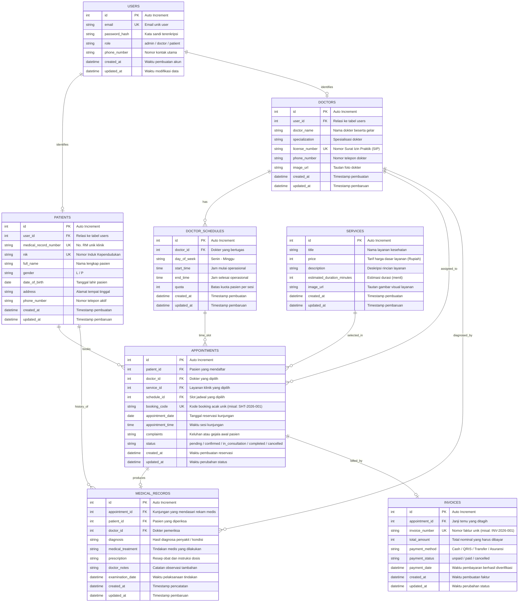

# 🗄️ Entity Relationship Diagram (ERD) — Klinik Sehatin
**Mata Kuliah:** Web Application Development (WAD)  
**Kelompok:** Kelompok 7  
**Proyek:** Sehatin — Sistem Manajemen & Reservasi Layanan Klinik Kesehatan  

---

## 📊 1. Diagram Relasi Entitas (Mermaid ERD)
Diagram di bawah ini menggambarkan seluruh entitas tabel basis data relasional serta hubungan keterkaitan antar tabel di dalam sistem **Sehatin**:

---

## 📑 2. Kamus Data & Rincian Struktur Tabel

### 1. Tabel `users`
Menyimpan akun kredensial akses ke sistem Sehatin, membedakan hak akses admin, dokter, dan pasien.
* **id** (`INT`, PK, Auto Increment): ID unik pengguna.
* **email** (`VARCHAR(150)`, UNIQUE, NOT NULL): Alamat email terdaftar untuk proses login.
* **password_hash** (`VARCHAR(255)`, NOT NULL): Hash password pengguna (bcrypt/argon2).
* **role** (`ENUM('admin', 'doctor', 'patient')`, NOT NULL): Hak akses pengguna dalam sistem.
* **phone_number** (`VARCHAR(20)`, NULL): Nomor telepon utama pengguna.
* **created_at** (`DATETIME`, DEFAULT CURRENT_TIMESTAMP): Waktu akun dibuat.
* **updated_at** (`DATETIME`, DEFAULT CURRENT_TIMESTAMP ON UPDATE CURRENT_TIMESTAMP): Waktu data diubah.

### 2. Tabel `patients`
Menyimpan profil demografis dan identitas kependudukan pasien.
* **id** (`INT`, PK, Auto Increment): ID unik pasien.
* **user_id** (`INT`, FK -> `users.id`, NULL): Kaitan opsional ke akun pengguna terdaftar.
* **medical_record_number** (`VARCHAR(30)`, UNIQUE, NOT NULL): Nomor Rekam Medis unik (No. RM).
* **nik** (`VARCHAR(16)`, UNIQUE, NOT NULL): Nomor Induk Kependudukan (KTP/Identitas).
* **full_name** (`VARCHAR(150)`, NOT NULL): Nama lengkap pasien.
* **gender** (`ENUM('L', 'P')`, NOT NULL): Jenis kelamin pasien.
* **date_of_birth** (`DATE`, NOT NULL): Tanggal lahir pasien.
* **address** (`TEXT`, NULL): Alamat lengkap tempat tinggal.
* **phone_number** (`VARCHAR(20)`, NOT NULL): Nomor telepon yang bisa dihubungi.
* **created_at** / **updated_at** (`DATETIME`): Metadata timestamp.

### 3. Tabel `doctors`
Menyimpan data tenaga medis spesialis di Klinik Sehatin.
* **id** (`INT`, PK, Auto Increment): ID unik dokter.
* **user_id** (`INT`, FK -> `users.id`, NULL): Kaitan ke akun pengguna dokter.
* **doctor_name** (`VARCHAR(150)`, NOT NULL): Nama lengkap dokter beserta gelar medis.
* **specialization** (`VARCHAR(100)`, NOT NULL): Bidang spesialisasi (Dokter Umum, Dokter Gigi, Dokter Kulit, Spesialis Penyakit Dalam).
* **license_number** (`VARCHAR(50)`, UNIQUE, NOT NULL): Nomor Surat Izin Praktik (SIP).
* **phone_number** (`VARCHAR(20)`, NULL): Nomor kontak dokter.
* **image_url** (`TEXT`, NULL): Tautan foto profil dokter.
* **created_at** / **updated_at** (`DATETIME`): Metadata timestamp.

### 4. Tabel `services`
Menyimpan katalog paket layanan kesehatan klinik yang disajikan pada antarmuka frontend (Konsultasi Umum, Pemeriksaan Gigi, Konsultasi Kulit, Medical Check-up).
* **id** (`INT`, PK, Auto Increment): ID unik layanan.
* **title** (`VARCHAR(150)`, NOT NULL): Nama layanan kesehatan.
* **price** (`INT`, NOT NULL): Tarif nominal biaya layanan dalam satuan Rupiah.
* **description** (`TEXT`, NULL): Deskripsi cakupan pemeriksaan dan fasilitas.
* **estimated_duration_minutes** (`INT`, DEFAULT 30): Estimasi durasi konsultasi/tindakan (menit).
* **image_url** (`TEXT`, NULL): Tautan gambar representatif dari Unsplash / CDN.
* **created_at** / **updated_at** (`DATETIME`): Metadata timestamp.

### 5. Tabel `doctor_schedules`
Menyimpan jadwal operasional praktek mingguan dokter untuk membatasi kuota antrean pasien.
* **id** (`INT`, PK, Auto Increment): ID unik jadwal praktek.
* **doctor_id** (`INT`, FK -> `doctors.id`, NOT NULL): Relasi ke dokter yang bertugas.
* **day_of_week** (`VARCHAR(20)`, NOT NULL): Hari praktek (contoh: 'Senin', 'Rabu', 'Jumat').
* **start_time** (`TIME`, NOT NULL): Jam mulai sesi praktek.
* **end_time** (`TIME`, NOT NULL): Jam berakhir sesi praktek.
* **quota** (`INT`, DEFAULT 15): Batas kuota antrean pasien per sesi hari.
* **created_at** / **updated_at** (`DATETIME`): Metadata timestamp.

### 6. Tabel `appointments`
Menyimpan transaksi reservasi dan janji temu kunjungan pasien ke klinik (*Jadwalkan Kunjungan*).
* **id** (`INT`, PK, Auto Increment): ID unik janji temu.
* **patient_id** (`INT`, FK -> `patients.id`, NOT NULL): Pasien yang membuat janji temu.
* **doctor_id** (`INT`, FK -> `doctors.id`, NOT NULL): Dokter yang dituju.
* **service_id** (`INT`, FK -> `services.id`, NOT NULL): Layanan medis yang dipilih.
* **schedule_id** (`INT`, FK -> `doctor_schedules.id`, NOT NULL): Slot jadwal praktek yang dipilih.
* **booking_code** (`VARCHAR(50)`, UNIQUE, NOT NULL): Kode unik booking untuk tracking pasien.
* **appointment_date** (`DATE`, NOT NULL): Tanggal rencana kunjungan.
* **appointment_time** (`TIME`, NOT NULL): Waktu estimasi sesi.
* **complaints** (`TEXT`, NULL): Keluhan awal atau riwayat gejala yang dialami pasien.
* **status** (`ENUM('pending', 'confirmed', 'in_consultation', 'completed', 'cancelled')`, DEFAULT 'pending'): Status alur reservasi.
* **created_at** / **updated_at** (`DATETIME`): Metadata timestamp.

### 7. Tabel `medical_records`
Menyimpan rekam medis resmi hasil pemeriksaan dokter (*Catatan Terarah*).
* **id** (`INT`, PK, Auto Increment): ID unik rekam medis.
* **appointment_id** (`INT`, FK -> `appointments.id`, UNIQUE, NOT NULL): Kunjungan yang diperiksa (1 kunjungan = 1 rekam medis).
* **patient_id** (`INT`, FK -> `patients.id`, NOT NULL): Pasien penerima pemeriksaan.
* **doctor_id** (`INT`, FK -> `doctors.id`, NOT NULL): Dokter pemeriksa.
* **diagnosis** (`TEXT`, NOT NULL): Diagnosa klinis penyakit/kondisi medis.
* **medical_treatment** (`TEXT`, NULL): Tindakan atau prosedur medis yang dijalankan.
* **prescription** (`TEXT`, NULL): Rincian obat, dosis, dan petunjuk pemakaian.
* **doctor_notes** (`TEXT`, NULL): Catatan observasi atau anjuran kontrol lanjutan.
* **examination_date** (`DATETIME`, NOT NULL): Waktu pelaksanaan pemeriksaan.
* **created_at** / **updated_at** (`DATETIME`): Metadata timestamp.

### 8. Tabel `invoices`
Menyimpan faktur tagihan biaya layanan dan catatan pelunasan pembayaran (*Pricing & Billing*).
* **id** (`INT`, PK, Auto Increment): ID unik tagihan.
* **appointment_id** (`INT`, FK -> `appointments.id`, UNIQUE, NOT NULL): Janji temu yang ditagihkan.
* **invoice_number** (`VARCHAR(50)`, UNIQUE, NOT NULL): Nomor resmi invoice transaksi.
* **total_amount** (`INT`, NOT NULL): Total tagihan pembayaran (Rupiah).
* **payment_method** (`ENUM('Cash', 'QRIS', 'Transfer', 'Asuransi')`, DEFAULT 'Cash'): Cara pembayaran.
* **payment_status** (`ENUM('unpaid', 'paid', 'cancelled')`, DEFAULT 'unpaid'): Status pelunasan.
* **payment_date** (`DATETIME`, NULL): Waktu pelunasan diverifikasi.
* **created_at** / **updated_at** (`DATETIME`): Metadata timestamp.

---

## 🔗 3. Penjelasan Hubungan & Kardinalitas Antar Entitas
1. **`users` ke `patients` (1 : 0..1)**: Satu akun pengguna dapat berperan sebagai satu data profil pasien.
2. **`users` ke `doctors` (1 : 0..1)**: Satu akun pengguna dapat berperan sebagai satu profil dokter.
3. **`doctors` ke `doctor_schedules` (1 : N)**: Satu dokter memiliki banyak slot jadwal praktek mingguan.
4. **`doctors` ke `appointments` (1 : N)**: Satu dokter dapat menangani banyak janji temu kunjungan pasien.
5. **`patients` ke `appointments` (1 : N)**: Satu pasien dapat memiliki riwayat banyak janji temu dari waktu ke waktu.
6. **`services` ke `appointments` (1 : N)**: Suatu paket layanan klinik dapat dipilih di banyak janji temu kunjungan.
7. **`doctor_schedules` ke `appointments` (1 : N)**: Suatu slot jadwal dapat menampung sejumlah kunjungan sesuai kuota yang tersedia.
8. **`appointments` ke `medical_records` (1 : 0..1)**: Setiap satu janji temu kunjungan yang selesai akan menghasilkan maksimal satu dokumen rekam medis.
9. **`appointments` ke `invoices` (1 : 0..1)**: Setiap satu janji temu kunjungan memiliki satu faktur tagihan pembayaran.
10. **`patients` ke `medical_records` (1 : N)**: Satu pasien memiliki banyak riwayat rekam medis selama menjadi pasien klinik.
